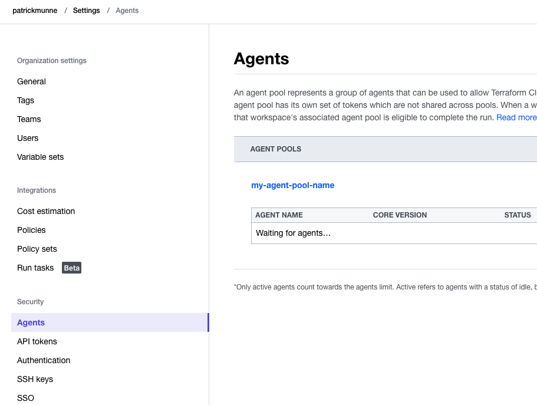
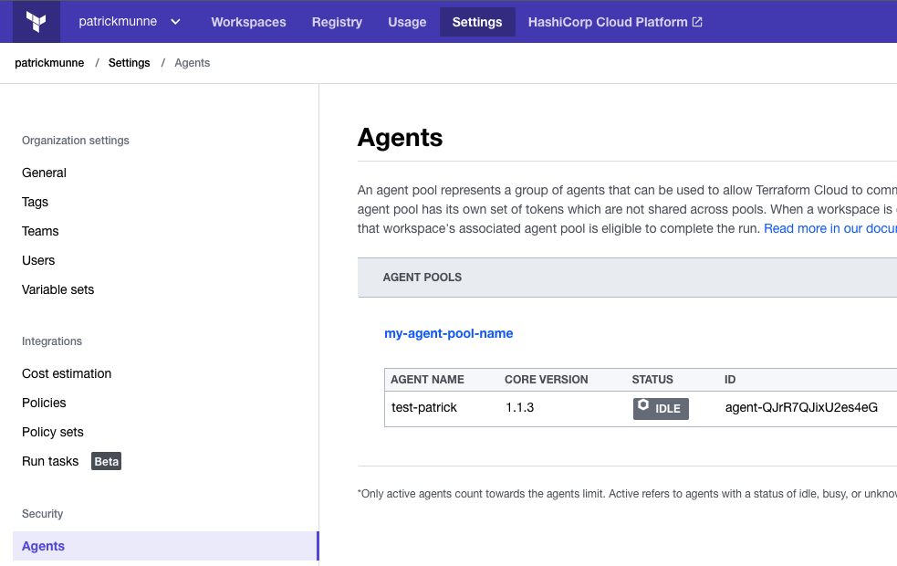
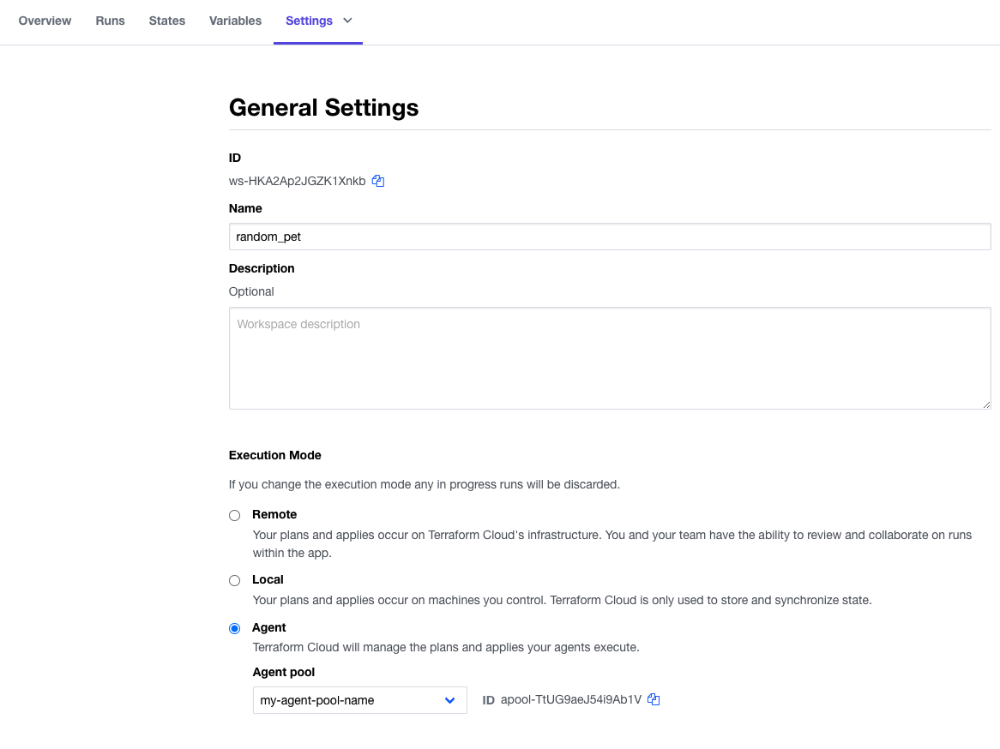
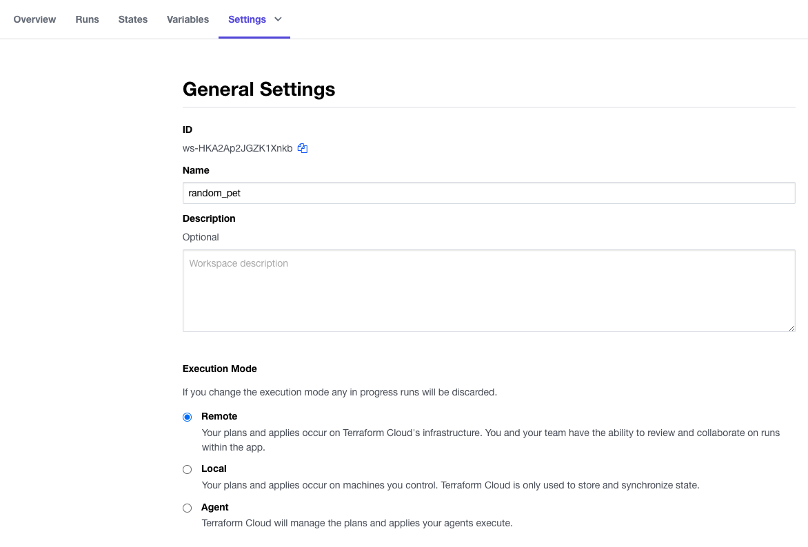

# tfc_provider_agent

This exercise will create an agent pool in Terraform Cloud using the tfe provider and resources. After the creation you start a docker image with HashiCorp agent software that will connect to Terraform Cloud. You can then connect this agent to a workspace and run Terraform code using this agent. 

Official documentation:
[HashiCorp Agents](https://www.terraform.io/cloud-docs/agents)  
[Terraform Resources](https://registry.terraform.io/providers/hashicorp/tfe/latest/docs/resources/agent_pool)

# Prerequesites

- Have a Terraform Cloud account 
See the following link [Terraform Cloud](https://app.terraform.io/signup/account)

## Install Docker
See the following documentation [How to install Docker](https://www.docker.com/products/docker-desktop/)

## Install terraform  
See the following documentation [How to install Terraform](https://learn.hashicorp.com/tutorials/terraform/install-cli)

# How to

- clone this repository to your machine
```
git clone https://github.com/munnep/tfc_provider_agent.git
```
- Go to the directory
```
cd tfc_provider_agent
```
- create a file called ```variables.auto.tfvars``` with the following content. The name of your Terraform Cloud Organization
```
organization_name = "name_of_your_organization"
```
- login to terraform cloud
```
terraform login
```
- run terraform init
```
terraform init
```
- run terraform plan
```
terraform plan
```
- run terraform apply
```
terraform apply
```
```
Apply complete! Resources: 2 added, 0 changed, 0 destroyed.

Outputs:

agent_token = <sensitive>
```
- Login to Terraform Cloud and under settings you should see the Agents. Settings -> Agents  
  
- run terraform output raw to get the token for the agent connection. Save this for later
```
terraform output -raw agent_token
```
- get the docker image with the agent
```
docker pull hashicorp/tfc-agent:latest
```
- run the docker image by change the TFC_AGENT_TOKEN=token_value
```
docker run -e TFC_AGENT_TOKEN=token_value -e TFC_AGENT_NAME=test-patrick hashicorp/tfc-agent
```
output:
```
2022-03-21T13:39:00.070Z [INFO]  agent: Starting: name=test-patrick version=1.1.3
2022-03-21T13:39:00.081Z [INFO]  core: Starting: version=1.1.3
2022-03-21T13:39:00.543Z [INFO]  core: Agent registered successfully with Terraform Cloud: agent.id=agent-QJrR7QJixU2es4eG agent.pool.id=apool-TtUG9aeJ54i9Ab1V
2022-03-21T13:39:00.609Z [INFO]  agent: Core version is up to date: version=1.1.3
2022-03-21T13:39:00.609Z [INFO]  core: Waiting for next job
```
- login to TFC and you should see the agent available under settings -> Agents 
  
- You can change a workspace to use this agent by workspace -> Settings -> General settings -> Execution mode
Change this to Agent --> Select the Agent pool just created  
  
- Save settings
- Run your workspace
- The output of the docker image should show something like this
```
2022-03-21T13:44:34.866Z [INFO]  core: Job received: job.type=plan job.id=run-cVE2ZxHw1yNPszXA
2022-03-21T13:44:34.866Z [INFO]  terraform: Handling run: run.id=run-cVE2ZxHw1yNPszXA run.operation=plan organization.name=patrickmunne workspace.name=random_pet
2022-03-21T13:44:34.867Z [INFO]  terraform: Downloading Terraform release: url=https://releases.hashicorp.com/terraform/1.1.6/terraform_1.1.6_linux_amd64.zip
2022-03-21T13:44:37.111Z [INFO]  terraform: Extracting Terraform from release archive
2022-03-21T13:44:37.530Z [INFO]  terraform: Terraform CLI details: version=1.1.6
2022-03-21T13:44:37.530Z [INFO]  terraform: Downloading Terraform configuration
2022-03-21T13:44:37.644Z [INFO]  terraform: Running terraform init
2022-03-21T13:44:40.527Z [INFO]  terraform: Running terraform plan
2022-03-21T13:44:42.691Z [INFO]  terraform: Generating and uploading plan JSON
2022-03-21T13:44:44.613Z [INFO]  terraform: Generating and uploading provider schemas JSON
2022-03-21T13:44:46.626Z [INFO]  terraform: Persisting filesystem to remote storage
2022-03-21T13:44:48.569Z [INFO]  terraform: Finished handling run
2022-03-21T13:44:48.802Z [INFO]  core: Waiting for next job
```
- stop the docker container running
- Change the workspace back to use the remote/local agent again and click save settings  
  
- run terraform destroy
```
terraform destroy
```
